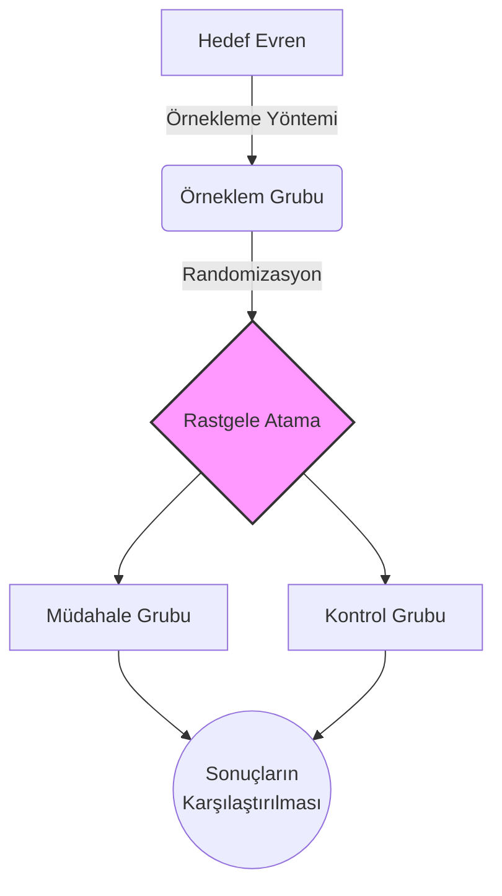

# Biyoistatistik Öğrenme Rehberi: Verilerin Hikayesini Okuma Sanatı

Hoş geldiniz! Biyoistatistik genellikle karmaşık formüller, ezberlenmesi gereken kurallar ve anlaşılmaz sayılar yığını olarak görülür. Ancak aslında bu, **elinizdeki verilerin size anlattığı hikayeyi doğru okuma sanatıdır.** Bu rehberde, "Ben bunu neden öğreniyorum?" sorusunu asla cevapsız bırakmadan, tıbbi araştırmaların temellerinden olasılığın büyülü dünyasına doğru adım adım bir yolculuğa çıkacağız. İşte biyoistatistiği bir yük olmaktan çıkarıp, mesleki hayatınızdaki en güçlü aracınız haline getirecek öğrenme haritamız:

---

## 🏗️ 1. Modül: Mimari ve Temeller (Neyi, Neden Yapıyoruz?)

İstatistiğe balıklama dalmadan önce "araştırma" kavramının temelini sağlam bir şekilde atıyoruz. Hedefimiz pusulamızı doğru ayarlamak.

* **Biyoistatistiğin Tıptaki Yeri:** Sağlık bilimlerinde kararlar alırken veriler neden bu kadar kritik? *(Madde 1)*
* **Araştırma Planlama:** Fikirden eyleme geçiş. Araştırmanın aşamaları, doğru konu seçimi ve net bir amaç belirleme sanatı. *(Madde 17, 18, 19, 20, 21)*
* **Araştırma Tasarımları:** Çalışmanızın iskeleti. Gözlemsel mi yoksa deneysel mi bir yol izleyeceksiniz? *(Madde 22, 23, 24, 25)*

---

## 🔬 2. Modül: Ham Madde ve Ölçüm (Veriyle Tanışma)

Elimizdeki malzeme ne ve biz bunu nasıl ölçeceğiz? Verinin doğasını anlamadan onu doğru analiz edemeyiz.

* **Değişkenler:** Verinin yapı taşları. Nitel mi, nicel mi?



**Kategorik verilerdir.** Sayısal bir büyüklük veya miktar ifade etmezler. 
*Örnek:* Kan grubu (A, B, AB, O), cinsiyet, medeni durum, hastalık şiddeti (Hafif, Orta, Ağır).


**Sayısal olarak ölçülebilen verilerdir.** Miktar, ağırlık veya derece bildirirler.
*Örnek:* Yaş (yıl), boy (cm), sistolik kan basıncı (mmHg), kandaki kolesterol düzeyi.

 *(Madde 2)*

* **Veri Toplama Araçları:** Doğru veriyi elde etmek için ölçek, anket ve test ayrımı. Güvenilir anket hazırlamanın altın kuralları. *(Madde 26, 27, 28)*

---

## 🎯 3. Modül: Kimden, Nasıl Seçiyoruz? (Örnekleme)

Tüm evreni tarayamayacağımıza göre, araştırmamız için en doğru ve temsil edici grubu nasıl seçeceğiz?

* **Temel Kavramlar:** Evren (Population) ve Örneklem (Sample) ayrımı. Parametre ile istatistik arasındaki ince çizgi. *(Madde 3, 4)*
* **Seçim Yöntemleri:** Araştırmanıza en uygun örnekleme yöntemini (olasılıklı veya olasılıksız) belirleme. *(Madde 5, 6)*
* **Randomizasyon (Rastgeleleştirme):** Bilimsel tarafsızlığın kalbi. Neden bu kadar hayati ve pratikte nasıl uygulanır? *(Madde 7, 8)*

---

## 📊 4. Modül: Veriyi Özetleme (Tanımlayıcı İstatistikler)

Elinizdeki karmaşık ve binlerce satırlık veriyi tek bir anlama, tek bir sayıya indirgeme aşaması.

* **Merkezi Eğilim Ölçüleri:** Verinin kalbi nerede atıyor? Ortalama (Mean), Ortanca (Median) ve Tepe Değeri (Mode). *(Madde 10, 12)*
* **Yaygınlık Ölçüleri:** Gözlemlerimiz merkeze ne kadar uzak? Standart sapma, varyans ve çeyreklikler. *(Madde 11, 12)*
* **Nitel Veri Özeti:** Yüzde ve frekansları doğru tabloya dökme ve yorumlama. *(Madde 9)*

---

## 🔮 5. Modül: Olasılığın Büyüsü ve Tahminleme (Final)

İşte "Asıl biyoistatistik buymuş!" diyeceğiniz, formüllerin anlam kazandığı ve elimizdeki veriden koca bir evrene dair çıkarımlar yaptığımız zirve noktası.

* **Olasılık Temelleri:** Şans kavramının tıbbi kararlardaki matematiksel karşılığı ve kuramlar. *(Madde 13)*
* **Dağılımlar:** Verilerin doğadaki davranış biçimleri. Kesikli (Binom, Poisson) ve Sürekli (Normal Dağılım) olasılık dağılımları. *(Madde 14, 15)*
* **Tahminleme (Estimation):** Küçük bir örneklemden yola çıkarak büyük resmi görme. Nokta tahminleri ve Güven Aralığı (Interval Estimation) hesaplamaları. *(Madde 16)*

> **Başlamaya Hazır Mısınız?** > Veri odaklı düşünme yeteneğinizi geliştirmek için soldaki menüden **1. Modül** ile hemen başlayabilirsiniz. Başarılar dileriz!